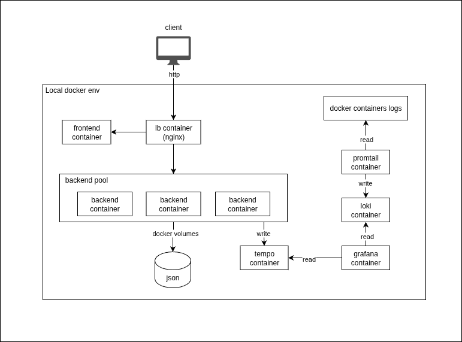

# Desafio Mercado Livre - Desenvolvedor Backend & Cloud Computing

    

-   **Candidato:** Lucas de Brito
-   **Entrega:** 15/07/25

## Visão Geral

Este projeto é uma solução fullstack, composta por um backend em NestJS e um frontend em React, organizados em uma estrutura de monorepo. Conforme encorajado, usei 2 IAs durante o desenvolvimento desse projeto, o ChatGPT para tirar dúvidas gerais e agilizar a criação de código e o Gemini com um Gem criado para ser especialista em escrita de testes unitários em NestJS e React.

O conteúdo todo está organizado em 4 partes principais, sendo backend, frontend, dependencies e data, como mostra a figura abaixo:

```
.
├── backend
├── frontend
├── data
│   └── datasource.json
├── dependencies
│   ├── grafana
│   ├── loki-config.yml
│   ├── promtail-config.yml
│   └── tempo-config.yml
├── docker-compose.deps.yml
├── docker-compose.dev.yml
├── docker-compose.yml
├── README.md
├── run.md
└── run.sh
```

Nos diretórios backend e frontend tem o codigo dos serviços, no dependencies todas as dependências externas de observabilidade para funcionamento dos serviços, incluindo Nginx, Grafana, Loki, Promtail e Tempo e no data o banco json mockado.

## Arquitetura da solução

O principal motivo da escolha das tecnologias utilizadas, foi o meu domínio sobre elas, visando otimizar o tempo disponível para execução do desafio, dessa forma eu pude investir o tempo em decisões de domínio e em desenvolver robustez para o ambiente, em vez de entendimento de tecnologias.

### Backend

-   **Framework:** NestJS (TypeScript).
-   **Módulos:** Cada domínio relevante (Product, Variant, Offer, Store, Option, Feature) possui seu próprio módulo, repositório e, quando necessário, controller e service.
-   **Documentação:** Swagger disponível no endpoint `/docs`.
-   **Health:** Tem um sistema básico sem validações de health no endpoint `/healthz`.
-   **Tratamento de Erros:** Filtro global customizado para exceções HTTP, com logging detalhado.
-   **Testes:** Estrutura de testes unitários com Jest.
-   **Exposição:** O backend expõe endpoints RESTful versionados (`/api/v1`).

### Frontend

-   **Framework:** React + Vite, com TypeScript e TailwindCSS para estilização.
-   **Arquitetura de Componentes:** Componentes funcionais, hooks customizados e separação clara entre páginas, componentes e serviços.
-   **Comunicação com Backend:** Camada de serviço (`productDetailsService`) que consome a API REST do backend via Axios, com tratamento de erros via interceptors.
-   **Roteamento:** React Router para navegação entre páginas (ProductDetails, Error, Search, NotFound).
-   **Testes:** Estrutura de testes com Vitest e Testing Library.

### Persistência de dados

-   **Banco:** Os dados da API estão sendo salvos em um arquivo JSON.
-   **Observabilidade:** Estão sendo salvos em volumes, gerenciados no docker-compose.

### Integração e Observabilidade

-   **Observabilidade:** Stack Grafana (Loki, Tempo e Promtail) para logs e traces, já configurada via docker-compose.
-   **Ambiente:** Baseado em containers docker, com Dockerfile e docker-compose já criados para facilitar o setup do projeto.

### Diagrama:



## Desafios

A parte geral do frontend e backend foram relativamente simples, mas algumas funcionalidades se mostraram desafiadoras. Por exemplo o selecionador de variação de produtos. Quando se tem apenas uma opção de variação é simples, mas quando combinam várias opções, por exemplo cor, armazenamento e memória, já se torna mais complexo. A decisão de qual variação será definida em cada combinação de opções, manipular tudo isso por frontend se mostrou difícil e com esforço alto.

Para solucionar isso, eu resolvi devolver o máximo de informações pelo backend. Ao buscar um produto pelo slug dele (endpoint principal), já é retornado também os dados da loja, as opções da variação selecionada, todas as variações possíveis para o produto geral, os dados de oferta, características e tudo mais e se o usuario selecionar uma variação que não existe, ele busca a próxima que faz sentido e define automaticamente, como é feito no site do Mercado Livre.

O dto de saída do backend para esse endpoint foi o seguinte:

```ts
export interface OfferOutputDto {
	price: number;
}

export interface StoreOutputDto {
	salesNumber: number;
	productsNumber: number;
	isOfficial: boolean;
	iconUrl: string;
	name: string;
	isPositiveService: boolean;
	isOnTimeDelivery: boolean;
	bannerUrl: string;
}

export interface OptoinValueOutputDto {
	id: number;
	value: string;
	imageUrl: string | null;
	optionId: number;
}

export interface OptionsOutputDto {
	value: string;
	id: number;
	optionValues: OptoinValueOutputDto[];
}

export interface FeatureOutputDto {
	key: string | null;
	value: string;
	iconUrl: string | null;
}

export interface VariantOptionOutputDto {
	optionId: number;
	optionValueId: number;
}

export interface VariantOutputDto {
	id: number;
	slug: string;
	stock: number;
	optionValues: VariantOptionOutputDto[];
}

export interface ReviewOutputDto {
	comment: string;
	rating: number;
	photos: string[];
}

export interface ProductOutputDto {
	slug: string;
	sku: string;
	title: string;
	description: string;
	price: number;
	quantity: number;
	quantitySold: number;
	rating: number;
	reviewCount: number;
	imageUrlList: string[];
	offer: OfferOutputDto | null;
	store: StoreOutputDto;
	options: OptionsOutputDto[];
	features: FeatureOutputDto[];
	variantOptions: VariantOptionOutputDto[];
	variants: VariantOutputDto[];
	reviews: ReviewOutputDto[];
}
```

## Como usar o projeto

Primeiro execute ele seguindo os passos do arquivo `run.md`.

Depois, você conseguirá acessar os serviços pelo localhost na porta 80. Seguindo as seguintes rotas.

Backend:

-   **health:** http://localhost/healthz
-   **swagger docs:** http://localhost/docs
-   **endpoints da api:** http://localhost/api/v1

Frontend:

-   **Tela inicial e busca:** http://localhost/
-   **Tela de not found:** http://localhost/not-found
-   **Tela de error:** http://localhost/error
-   **Tela de detalhes do produto:** http://localhost/:slug

Minha indicação é que você vá até a página inicial, clique no input de busca e selecione algum dos itens sugeridos. Isso te levará à tela solicitada pelo desafio de detalhes do produto.

Além disso, você poderá ter acesso ao grafana e aos dashboards de logs e traces pelo seguinte link:

http://localhost:3300/dashboards

Use o usuário padrão admin para logar no Grafana

-   user: admin
-   pass: admin
